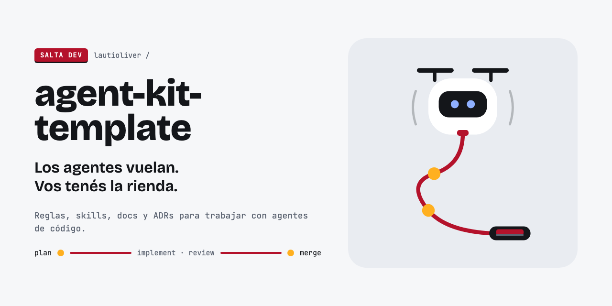

# Marca de agent-kit-template

Identidad de la plantilla, no de los proyectos que salen de ella: `init-plantilla.sh` borra esta carpeta y el bloque de marca del README.

## Idea

**Barrilete** es un dron atado a una correa con dos nudos. Vuela y explora solo, pero el mango, y la última palabra, quedan en tu mano.

- **Lema:** "Los agentes vuelan. Vos tenés la rienda." En la terminal: `>_ los agentes vuelan, vos tenés la rienda`.
- **Los dos nudos** son los dos puntos de control que quedan siempre en manos de personas: aprobar el plan y mergear (plan ● — implement · review — ● merge).
- **Sello:** `SALTA DEV`, blanco sobre rojo con borde inferior en tinta.

## Ícono

| 128 px | 64 px | 32 px | Fondo oscuro |
|---|---|---|---|
|  |  |  |  |

Cada tamaño tiene su propio dibujo: a 64 px se engrosan hélices y ojos, a 32 px desaparece la cara clara y quedan ojos y boca grandes sobre la silueta en tinta. No escalar el de 128 a 32.

## Estados

Para issues, PRs y el README.

| Estado | Cuándo | Archivo |
|---|---|---|
|  trabajando | `/implement-issue` en curso | [`estados/trabajando.svg`](estados/trabajando.svg) |
|  planificando | `/plan-feature` en curso | [`estados/planificando.svg`](estados/planificando.svg) |
|  bloqueado | label `estado:bloqueado` | [`estados/bloqueado.svg`](estados/bloqueado.svg) |
|  PR listo | esperando tu merge (la boca pasa a ámbar) | [`estados/pr-listo.svg`](estados/pr-listo.svg) |

## Paleta

| Rol | Color |
|---|---|
| Tinta (texto, hélices, visor) | `#14161A` |
| Gris (texto secundario) | `#5A6270` |
| Fondo | `#F6F7F9` |
| Superficie (cuerpo, paneles) | `#E9ECF1` |
| Blanco | `#FFFFFF` |
| Rojo (correa, boca, sello) | `#B4122B` |
| Ámbar (nudos, PR listo) | `#FFB020` |
| Ojos | `#8FB0FF` |
| Azul (prompt `>_`) | `#2B59FF` |
| Bloqueado (ojos en cruz) | `#FF8A96` |

## Tipografía

- **Bricolage Grotesque** 800 para títulos y 600 para el lema.
- **JetBrains Mono** 400 y 500 para todo lo demás (texto, etiquetas, sello).

Las dos son de Google Fonts (licencia OFL).

## Social preview

[`social-preview.png`](social-preview.png) (1280×640) se sube a mano en GitHub: **Settings → General → Social preview**. La fuente es [`social-preview.html`](social-preview.html); si cambia el texto, regenerá el PNG con el comando que tiene en el encabezado.
