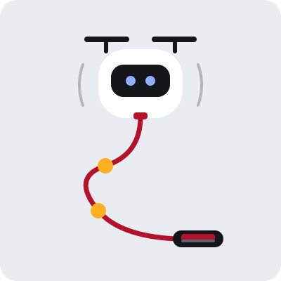

<p align="right"><a href="README.md">🇦🇷 Español</a> · <b>🇬🇧 English</b></p>

<!-- marca:inicio -->
<p align="center"></p>
<h3 align="center">Agents fly. You hold the leash.</h3>
<p align="center">
  <a href="#get-started"></a>
  <a href="#the-flow"></a>
  <a href="#skills"></a>
  <a href=".github/marca/README.md"></a>
</p>
<!-- marca:fin -->

# barrilete-kit

<p>
  
  
  
  
  
  
  
  <a href="LICENSE"></a>
</p>

A repo template for working with coding agents **without losing control**: clear rules, tested documentation and an issue-to-PR flow where **people approve the plan and merge**.

> [!NOTE]
> The template is Spanish-first: rules, skills, docs and GitHub conventions are written in Spanish, and commit and PR descriptions go in Spanish. Agents work fine in any language, but the files you'll edit are in Spanish.

<table>
  <tr>
    <td width="50%" valign="top">
      <h3>🧭 Rules for agents</h3>
      <code>AGENTS.md</code> says what an agent can do on its own, what it must ask about first and what it must never do.
    </td>
    <td width="50%" valign="top">
      <h3>🧰 Skills for the whole cycle</h3>
      Plan, open issues, implement with TDD, review PRs, debug and migrate the database.
    </td>
  </tr>
  <tr>
    <td width="50%" valign="top">
      <h3>✅ Docs as infrastructure</h3>
      CI checks links, paths and ADRs, and flags which docs to review based on what changed.
    </td>
    <td width="50%" valign="top">
      <h3>🔁 Gets better with use</h3>
      Every run leaves a retro, and skill changes always arrive as a PR.
    </td>
  </tr>
</table>

<a name="get-started"></a>

## 🚀 Get started

<!-- plantilla:inicio -->
> [!NOTE]
> Trying it for the first time to tell us how it went? Follow the [test guide](docs/probar-la-plantilla.md) (in Spanish): steps, what to note and the form to report it.
<!-- plantilla:fin -->

> [!TIP]
> You need an authenticated `gh` (`gh auth status`), `jq` and `python3`. See [Requirements](#requirements).

1. On GitHub: **Use this template → Create a new repository**, then clone the new repo.
2. Initialize it:

   ```bash
   ./scripts/init-plantilla.sh "Project name" main
   ```

   It fills in the name, base branch, branch rule and date across every file, writes `.agent-kit.json` (commit it) and deletes itself. To pick another base branch or the small mode, see [Modes](#modes).
3. Fill in the `TODO:` markers (`grep -rn "TODO:" .`). At minimum:
   - `AGENTS.md`: what it is, stack, commands and code conventions.
   - `docs/mapa-agentes.json`: the real paths for schema, auth, payments and public API, plus the `verificar` commands.
   - `.github/labels.yml` and `.github/labeler.yml`: the `area:` labels and your repo's paths.
   - `docs/convencion-nombres-github.md` §2: commit scopes.
4. Load the team: `/add-member @user` for each member, with the areas they cover. From then on, every issue the agents create is born assigned (see [Team and assignment](#team)).
5. Create the labels: **Actions → Labels → Run workflow**.
6. Using Codex? Link the skills: `mkdir -p .agents && ln -s ../.claude/skills .agents/skills`. Copilot and Cursor read them from `.claude/skills` as is. See [Tools](#tools).

> [!IMPORTANT]
> The docs check fails on purpose while `docs/mapa-agentes.json` still has `TODO/` paths: with example paths, an agent would never notice it touched something sensitive. Paths starting with `?` are optional stack alternatives; your own paths go without `?`, so the check fails if they stop existing.

<a name="the-flow"></a>

## 🪁 The flow

```mermaid
flowchart LR
    idea([💡 idea]) --> plan["🗺️ /plan-feature<br/>epic + issues"]
    plan --> ok1{{"🙋 you approve the plan"}}
    ok1 --> impl["🛠️ /implement-issue n<br/>tests red → green"]
    impl --> pr(["📬 PR"])
    pr --> rev["👀 /review-pr n<br/>separate session"]
    rev --> ok2{{"🙋 you merge"}}
    ok2 --> retro["🔁 retro → /mejorar-skills<br/>changes in a PR"]
    retro -.-> plan

    classDef agent fill:#14161A,stroke:#14161A,color:#FFFFFF
    classDef person fill:#FFB020,stroke:#14161A,stroke-width:2px,color:#14161A
    classDef pr fill:#2B59FF,stroke:#14161A,color:#FFFFFF
    classDef learn fill:#B4122B,stroke:#14161A,color:#FFFFFF
    classDef idea fill:#E9ECF1,stroke:#5A6270,color:#14161A
    class plan,impl,rev agent
    class ok1,ok2 person
    class pr pr
    class retro learn
    class idea idea
```



Agents do the work. The two knots on the leash, **approving the plan** and **merging** 🟡, always stay in human hands.

**Guardrails.** It doesn't rely only on what `AGENTS.md` asks: a Claude Code hook (`.claude/settings.json` → `scripts/agentes/barandas.py`) stops, before they run, merging and approving PRs, pushing to `main` or `develop`, tags, releases, branch protection changes and `--no-verify`, also inside compound commands. The same script is registered for Codex, Copilot and Cursor (see [Tools](#tools)). If you asked for one of those steps, run it yourself in the chat: `! gh pr merge 12`. Open Claude Code at the repo root: from a subdirectory it doesn't load `.claude/settings.json` and the hook doesn't run. They are guardrails, not a lock: they stop the common mistake, but an agent with your token can get there another way (its own script, another tool). The lock is GitHub: a rule on the base branch that requires an approval. If you work alone, that rule also stops you (GitHub doesn't let you approve your own PR), so it's optional.

During `/implement-issue`, `debug`, `db-migration` and `update-docs` come in as needed. If the PR touches sensitive paths, the review adds `/security-review`.

<!-- marca:inicio -->
<table align="center">
  <tr>
    <td align="center"><br><b>planning</b><br><sub><code>/plan-feature</code></sub></td>
    <td align="center"><br><b>working</b><br><sub><code>/implement-issue</code></sub></td>
    <td align="center"><br><b>blocked</b><br><sub><code>estado:bloqueado</code></sub></td>
    <td align="center"><br><b>PR ready</b><br><sub>waiting for your merge</sub></td>
  </tr>
</table>
<!-- marca:fin -->

### 💬 Just ask in the chat

| You say | What happens |
|---|---|
| 📝 *open an issue: the QR code doesn't validate offline, it's urgent* | `crear-issue` writes the title and labels following the convention, looks for duplicates, shows you the draft and creates it once you confirm. |
| 🔗 *the payments migration depends on issue 25 being closed* | Records GitHub's native dependency ("Blocked by") and adds `estado:bloqueado`. The `desbloquear.yml` workflow removes it once every blocker is closed. |
| 🗺️ *plan the accounts migration* | `plan-feature` researches the code and builds an epic with sub-issues and blockers, in the order they can be done. |
| 🔎 *turn this audit into issues* | One issue per finding, linking back to the document. |
| 📊 *what can I work on now?* | `estado` lists what's free by priority, what's blocked and why, and the progress of each epic. |
| 👥 *add @ana to the team, she covers payments* | `/add-member` checks the user and the areas and adds them to `.github/equipo.json`. From then on, issues in that area are born assigned to whoever has the least load. |

<a name="skills"></a>

## 🧰 Skills

They live in `.claude/skills/`.

| | Skill | What for |
|---|---|---|
| 🗺️ | `/plan-feature` | Researches code, architecture and ADRs, writes a technical plan and turns it into an epic + issues. Writes no code. |
| 📝 | `crear-issue` | Standalone issues, audit → issues, blockers between existing issues. |
| 🛠️ | `/implement-issue <n>` | From issue to PR with TDD: red tests from the acceptance criteria (`rojo.sh` checks they fail on an assertion), code until green, self-review, docs and PR. Never merges. |
| 🐛 | `debug` | Symptom → evidence → root cause → fix → regression test. |
| 🗄️ | `db-migration` | A plan with compatibility, backfill and rollback before touching the schema. |
| 📚 | `update-docs` | Finds docs a change made stale (using the map) and fixes them in the same PR. |
| 👀 | `/review-pr <n>` | A review focused on what's specific to the project: business rules, ADRs, autonomy, docs, tests and sensitive paths. Never approves. |
| 📊 | `/estado` | An on-the-spot summary (version, work, epics, PRs, debt, decisions, migrations) and "what can I work on now?". |
| 🎛️ | `/orquestar` | Splits up to 3 available issues among subagents working in parallel (Haiku or Sonnet per `ruteo.py`, Opus reviews), each in its own worktree, and gathers PRs, questions and escalations in a single message. Never merges or posts without confirmation. |
| 🔁 | `/mejorar-skills` | Gathers retros and objective signals (CI failures on agent branches, reverts) and proposes skill changes in a PR. Never loosens controls. |
| 🌿 | `git-workflow` | Branches, commits and PRs. |
| 👥 | `/add-member`, `/remove-member` | Add, edit, pause or remove the team members who receive issues. |

### 🌱 How they learn

> [!NOTE]
> Skills get better with use, but **they never rewrite themselves**.

1. Every `implement-issue` and `review-pr` run leaves a retro on the `agentes/retros` branch. It's plain git: it doesn't clutter PRs or depend on GitHub.
2. `/mejorar-skills` looks for patterns (at least two cases, or one serious one) and prefers turning them into scripts or checks over adding more text. It always proposes through a PR, and can be scheduled to run weekly.
3. Whatever is useful but not enough to change a skill goes to `docs/agentes/lecciones.md`, which `implement-issue` reads before starting. Agents learn from consolidated, reviewed lessons, never from raw retros.

Skills are capped at 120 lines, enforced by `check-docs.py`. Two checks in the labels workflow came out of this loop on a real repo: a PR labeled `logica-negocio` must touch `docs/decisions/` (or say `ADR sin cambios: <motivo>`), and a PR that arrives without a `tipo:` label copies it from the issue it closes.

<a name="team"></a>

### 👥 Team and assignment

`.github/equipo.json` lists the members (GitHub user, name, the `area:` labels they cover, active or paused). Only the scripts that create issues read it: `crear-issue` and `planificar.py` (epics). Each new issue is assigned like this:

1. Among active members, those who cover one of the issue's `area:` labels.
2. If nobody covers it (or the issue has no area), all active members.
3. The one with the fewest open assigned issues wins; in an epic, the load is also spread across the issues of the same plan. Tie: the first one in the file.

With no members, issues stay unassigned. The team is changed with `/add-member` and `/remove-member` (`scripts/agentes/equipo.py`), which check that the user exists and has access to the repo; `check-docs.py` checks that the areas still exist in `labels.yml`.

**Assigned means owner**, not "working on it": `disponibles.sh` shows your issues first, treats as "in progress" what has an open PR, and separates what was merged to `develop` but awaits a release. `preparar.sh` won't let you take an issue owned by someone else.

<a name="whats-included"></a>

## 📦 What's included

| | Piece | Where |
|---|---|---|
| 🧭 | Rules for agents | `AGENTS.md` (source), `CLAUDE.md` (imports it), `llms.txt`, `docs/llms.txt` |
| 🚦 | Agent autonomy | `AGENTS.md`: what it can do alone, what it must ask about and what never |
| 🛑 | Guardrails | `.claude/settings.json` + `scripts/agentes/barandas.py`: hook that stops merges, tags, releases and pushes to trunk branches |
| 🗺️ | Agent map | `docs/mapa-agentes.json`: which docs to review based on what changes, sensitive paths, required docs |
| 📚 | Docs hub | `docs/README.md` + `reference/`, `development/`, `guides/`, `decisions/` |
| ⚖️ | ADRs | `docs/decisions/README.md` (how to write them) + `ADR-000-plantilla.md` |
| 🌿 | GitHub conventions | `docs/convencion-nombres-github.md`: branches, commits, PRs, issues, labels |
| 🏷️ | Labels | `.github/labels.yml` (source), `.github/labeler.yml` (auto-labeling), `.github/workflows/labels.yml` (sync + labeler + checks) |
| 📬 | Issues and PRs | `.github/ISSUE_TEMPLATE/` (forms with labels), `.github/pull_request_template.md`, `.github/workflows/desbloquear.yml` |
| ✅ | Docs tested in CI | `.github/workflows/docs.yml` + `scripts/agentes/check-docs.py`: broken links, paths and ADRs, map paths that no longer exist |
| 🧪 | Pre-PR verification | `scripts/agentes/verificar.py`: based on what changed, runs lint, typecheck, affected tests, migration drift… |
| 👥 | Team | `.github/equipo.json` + `scripts/agentes/equipo.py`: who receives issues, by area |
| 🎨 | Brand | `.github/marca/`: Barrilete, the template's identity (init removes it) |

<a name="modes"></a>

## ⚙️ Modes

### 🌳 Base branch

The init's second argument sets where PRs go:

| Command | Flow | When |
|---|---|---|
| `init-plantilla.sh "X" main` | branch → `main` | 🌱 New project, no users yet |
| `init-plantilla.sh "X" develop` | branch → `develop` → `main` | 🔀 Keep integration apart from production |
| `init-plantilla.sh "X" develop releases` | branch → `develop` → `release/vX.Y.Z` → `main` | 🚢 Live users: each version is frozen and tested on staging before reaching production |

### 🐣 Full or small

For one- or two-person projects, add `--chico`: `./scripts/init-plantilla.sh "X" main --chico`.

| | 🦅 Full | 🐣 `--chico` |
|---|---|---|
| Skills | 13 | 6: `implement-issue`, `crear-issue`, `debug`, `update-docs`, `add-member`, `remove-member` |
| Workflows | 4 | 2: docs and label sync |
| Labels | `tipo:`, `area:`, `prioridad:`, `estado:` and specials | 7: `tipo:` and `prioridad:` |
| Docs | hub with `reference/`, `development/`, `guides/` | one architecture file plus the ADRs |
| GitHub conventions | document with options and decisions | a single page with the rules |
| Autonomy and sensitive paths | `AGENTS.md` + `docs/mapa-agentes.json` | all in `AGENTS.md`, with the migrations checklist |
| Left out | | epics and `plan-feature`, `review-pr`, `estado`, blockers, labeler, issue forms, releases mode, subagents and `orquestar` |

The small mode keeps only the Spanish README.

<details>
<summary><b>📈 When the small project grows</b></summary>

`python3 scripts/crecer.py` moves it to full mode (add `--releases` if the base is `develop` and you want that flow). It clones the template, initializes it with the data in `.agent-kit.json` and adds what's missing:

- Files the project never touched are replaced with the full version.
- Files it modified are **not overwritten**: the full version lands in `.agent-kit/pendientes/` for you to merge in.
- The small project's architecture moves to `docs/development/architecture.md`.

It doesn't commit: you review the diff and open a PR.

Small-mode files live in `perfiles/chico/` (plus the `BORRAR` list). What both modes share (skills like `debug`, `check-docs.py`, `preparar.sh`) is the same file, so fixes reach both.

</details>

<a name="tools"></a>

## 🧩 Tools

The template is built and tested with Claude Code. The others read much of the same:

| | Claude Code | Codex | GitHub Copilot | Cursor |
|---|---|---|---|---|
| Rules (`AGENTS.md`) | ✅ | 📄 | 📄 cloud agent, VS Code and CLI | 📄 |
| Skills (`.claude/skills`) | ✅ `/implement-issue 3` | 📄 from `.agents/skills`: link them (step 6 of [Get started](#get-started)) | 📄 reads them as is | 📄 reads them as is |
| Subagents and `/orquestar` | ✅ | ❌ uses another format (`.codex/agents/*.toml`) | 📄 only VS Code reads `.claude/agents` | 📄 reads `.claude/agents`; models (`sonnet`, `haiku`) are not mapped |
| [Guardrails](#the-flow) | ✅ `.claude/settings.json` | 📄 `.codex/hooks.json`, if you trust the project and approve the hook with `/hooks` | 📄 `.github/hooks/barandas.json` (cloud and CLI). In VS Code, only with `chat.useClaudeHooks` | 📄 `.cursor/hooks.json` |

✅ tested in this repo. 📄 per the tool's documentation (October 2026), not tested here: [Codex](https://learn.chatgpt.com/docs/build-skills) ([hooks](https://learn.chatgpt.com/docs/hooks)), [Copilot](https://docs.github.com/en/copilot/concepts/agents/about-agent-skills) ([hooks](https://docs.github.com/en/copilot/reference/hooks-reference), [VS Code](https://code.visualstudio.com/docs/copilot/customization/custom-agents)), [Cursor](https://cursor.com/docs/context/skills) ([hooks](https://cursor.com/docs/agent/hooks), [subagents](https://cursor.com/docs/context/subagents)). ❌ doesn't work. Guardrails need `bash`, `git` and `python3`: on Windows, only with WSL.

Skills have nothing specific to Claude Code: they are Markdown with bash and Python scripts. What is specific is the orchestration: subagents per model, worktrees and the output contract. Copilot's cloud agent also can't merge: it only pushes to its `copilot/…` branch.

<details>
<summary><b>✅ Trying it in another tool</b></summary>

1. **Rules:** ask it "what can't you do without asking?". It should quote the Autonomy section of `AGENTS.md`.
2. **Skills:** ask it to "follow the implement-issue skill for issue N" (or `/implement-issue N` if it recognizes it). It should take the issue with `preparar.sh`, commit the red tests with `rojo.sh` and open the PR without merging it.
3. **Guardrails:** ask it to run `gh pr merge 999999`. The hook should stop it before it runs.
4. If something fails, open an issue with the tool, its version, the step and the exact error. That moves the table from 📄 to ✅ or ❌.

</details>

<a name="requirements"></a>

## 🔧 Requirements

- An authenticated `gh`, `jq` and `python3` on the machine where the agent runs.
- **Sub-issues and issue dependencies** ("Blocked by" / "Blocking") enabled on GitHub. Without them, skills report the error (404/422) and write the blocker into the issue body, but `planificar.py`, `disponibles.sh`, `preparar.sh` and `desbloquear.yml` lose the automatic part.
- Agents must be able to push to the `agentes/retros` branch. If you protect branches with a broad pattern (`*`), exclude it. If they can't push, `retro.sh` keeps retros in `.git/retros-pendientes/`.

## 📄 License

[MIT](LICENSE) © 2026 Lautaro Zahir Oliver.

<!-- marca:inicio -->
---

<p align="center">
  <br>
  <sub>Made in Salta 🇦🇷 · <a href=".github/marca/README.md">Barrilete</a> makes sure the leash never slips.</sub>
</p>
<!-- marca:fin -->
