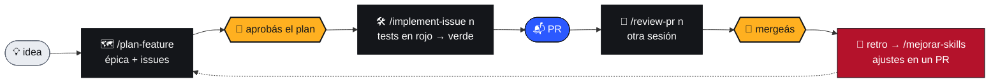

<p align="right"><b>🇦🇷 Español</b> · <a href="README.en.md">🇬🇧 English</a></p>

<!-- marca:inicio -->
<p align="center"></p>
<h3 align="center">Los agentes vuelan. Vos tenés la rienda.</h3>
<p align="center">
  <a href="#empezar"></a>
  <a href="#el-flujo"></a>
  <a href="#skills"></a>
  <a href=".github/marca/README.md"></a>
</p>
<!-- marca:fin -->

# agent-kit-template

<p>
  
  
  
  
  
  
  
</p>

Plantilla de repo para trabajar con agentes de código **sin perder el control**: reglas claras, documentación que se testea y un flujo de issue a PR donde **las personas aprueban el plan y mergean**.

<table>
  <tr>
    <td width="50%" valign="top">
      <h3>🧭 Reglas para agentes</h3>
      <code>AGENTS.md</code> dice qué puede hacer un agente solo, qué tiene que consultar y qué nunca.
    </td>
    <td width="50%" valign="top">
      <h3>🧰 Skills para todo el ciclo</h3>
      Planificar, abrir issues, implementar con TDD, revisar PRs, debuggear y migrar la base.
    </td>
  </tr>
  <tr>
    <td width="50%" valign="top">
      <h3>✅ Docs como infraestructura</h3>
      CI valida links, rutas y ADRs, y avisa qué docs revisar según lo que cambió.
    </td>
    <td width="50%" valign="top">
      <h3>🔁 Mejora con el uso</h3>
      Cada corrida deja una retro, y los ajustes a las skills llegan siempre en un PR.
    </td>
  </tr>
</table>

<a name="empezar"></a>

## 🚀 Empezar

> [!TIP]
> Necesitás `gh` autenticado (`gh auth status`), `jq` y `python3`. Ver [Requisitos](#requisitos).

1. En GitHub: **Use this template → Create a new repository**, y cloná el repo nuevo.
2. Inicializalo:

   ```bash
   ./scripts/init-plantilla.sh "Nombre del proyecto" main
   ```

   Pone el nombre, la rama base, la regla de ramas y la fecha en todos los archivos, escribe `.agent-kit.json` (commitealo) y se borra solo. Para elegir otra rama base o el modo chico, ver [Modos](#modos).
3. Completá los `TODO:` (`grep -rn "TODO:" .`). Lo mínimo:
   - `AGENTS.md`: qué es, stack, comandos y convenciones de código.
   - `docs/mapa-agentes.json`: las rutas reales de schema, auth, pagos y API pública, y los comandos de `verificar`.
   - `.github/labels.yml` y `.github/labeler.yml`: los labels `area:` y las rutas de tu repo.
   - `docs/convencion-nombres-github.md` §2: los scopes de commit.
4. Creá los labels: **Actions → Labels → Run workflow**.
5. ¿Usás Cursor? Enlazá las skills: `ln -s ../.claude/skills .cursor/skills`.

> [!IMPORTANT]
> El check de docs falla a propósito mientras queden rutas `TODO/` en `docs/mapa-agentes.json`: con rutas de ejemplo, un agente nunca detectaría que tocó algo sensible. Las rutas con `?` adelante son alternativas de stack opcionales; las propias van sin `?`, así el check falla si dejan de existir.

<a name="el-flujo"></a>

## 🪁 El flujo



Los agentes hacen el trabajo. Los dos nudos de la correa, **aprobar el plan** y **mergear** 🟡, quedan siempre en manos de personas.

Durante `/implement-issue` se usan, según haga falta, `debug`, `db-migration` y `update-docs`. Si el PR toca rutas sensibles, la revisión suma `/security-review`.

<!-- marca:inicio -->
<table align="center">
  <tr>
    <td align="center"><br><b>planificando</b><br><sub><code>/plan-feature</code></sub></td>
    <td align="center"><br><b>trabajando</b><br><sub><code>/implement-issue</code></sub></td>
    <td align="center"><br><b>bloqueado</b><br><sub><code>estado:bloqueado</code></sub></td>
    <td align="center"><br><b>PR listo</b><br><sub>esperando tu merge</sub></td>
  </tr>
</table>
<!-- marca:fin -->

### 💬 Pedíselo en el chat

| Decís | Pasa |
|---|---|
| 📝 *abrí un issue: el QR no valida sin conexión, es urgente* | `crear-issue` arma título y labels según la convención, busca duplicados, te muestra el borrador y lo crea cuando confirmás. |
| 🔗 *la migración de pagos depende de que se cierre el issue 25* | Registra el bloqueo nativo de GitHub ("Blocked by") y pone `estado:bloqueado`. El workflow `desbloquear.yml` lo saca cuando se cierran los bloqueantes. |
| 🗺️ *planificá la migración de cuentas* | `plan-feature` investiga el código y arma una épica con sub-issues y bloqueos, en el orden en que se pueden hacer. |
| 🔎 *pasá esta auditoría a issues* | Un issue por hallazgo, con el link al documento. |
| 📊 *¿qué puedo hacer ahora?* | `estado` lista lo que está libre por prioridad, lo bloqueado con su motivo y el avance de cada épica. |

<a name="skills"></a>

## 🧰 Skills

Viven en `.claude/skills/`.

| | Skill | Para qué |
|---|---|---|
| 🗺️ | `/plan-feature` | Investiga código, arquitectura y ADRs, arma un plan técnico y lo convierte en épica + issues. No escribe código. |
| 📝 | `crear-issue` | Issues sueltos, auditoría → issues, bloqueos entre issues existentes. |
| 🛠️ | `/implement-issue <n>` | Del issue al PR con TDD: tests en rojo desde los criterios de aceptación (`rojo.sh` comprueba que fallen por una aserción), código hasta verde, autorevisión, docs y PR. No mergea. |
| 🐛 | `debug` | Síntoma → evidencia → causa raíz → arreglo → test de regresión. |
| 🗄️ | `db-migration` | Plan con compatibilidad, backfill y rollback antes de tocar el schema. |
| 📚 | `update-docs` | Qué docs quedaron viejos por un cambio (según el mapa) y corregirlos en el mismo PR. |
| 👀 | `/review-pr <n>` | Revisión con foco en lo propio del proyecto: reglas de negocio, ADRs, autonomía, docs, tests y rutas sensibles. No aprueba. |
| 📊 | `/estado` | Resumen generado en el momento (versión, trabajo, épicas, PRs, deuda, decisiones, migraciones) y "¿qué puedo hacer ahora?". |
| 🔁 | `/mejorar-skills` | Junta las retros y las señales objetivas (fallas de CI en ramas de agentes, reverts) y propone ajustes a las skills en un PR. Nunca afloja controles. |
| 🌿 | `git-workflow` | Ramas, commits y PRs. |

### 🌱 Cómo aprenden

> [!NOTE]
> Las skills mejoran con el uso, pero **no se reescriben solas**.

1. Cada `implement-issue` y `review-pr` deja una retro en la rama `agentes/retros`. Es solo git: no ensucia los PRs ni depende de GitHub.
2. `/mejorar-skills` busca patrones (al menos dos casos, o uno grave) y prefiere convertirlos en scripts o checks antes que en más texto. Siempre propone en un PR, y se puede programar para que corra una vez por semana.
3. Lo que sirve pero no alcanza para cambiar una skill va a `docs/agentes/lecciones.md`, que `implement-issue` lee antes de empezar. Los agentes aprenden de lo consolidado y revisado, nunca de retros crudas.

Las skills tienen un máximo de 120 líneas, que controla `check-docs.py`. Dos checks del workflow de labels salieron de este circuito en un repo real: un PR con `logica-negocio` tiene que tocar `docs/decisions/` (o decir `ADR sin cambios: <motivo>`), y un PR que llega sin `tipo:` lo copia del issue que cierra.

<a name="que-trae"></a>

## 📦 Qué trae

| | Pieza | Dónde |
|---|---|---|
| 🧭 | Reglas para agentes | `AGENTS.md` (fuente), `CLAUDE.md` (lo importa), `llms.txt`, `docs/llms.txt` |
| 🚦 | Autonomía del agente | `AGENTS.md`: qué puede hacer solo, qué tiene que consultar y qué nunca |
| 🗺️ | Mapa para agentes | `docs/mapa-agentes.json`: qué docs revisar según lo que cambia, rutas sensibles, docs obligatorios |
| 📚 | Hub de documentación | `docs/README.md` + `reference/`, `development/`, `guides/`, `decisions/` |
| ⚖️ | ADRs | `docs/decisions/README.md` (cómo se escriben) + `ADR-000-plantilla.md` |
| 🌿 | Convenciones de GitHub | `docs/convencion-nombres-github.md`: ramas, commits, PRs, issues, labels |
| 🏷️ | Labels | `.github/labels.yml` (fuente), `.github/labeler.yml` (auto-etiquetado), `.github/workflows/labels.yml` (sync + labeler + checks) |
| 📬 | Issues y PRs | `.github/ISSUE_TEMPLATE/` (formularios con labels), `.github/pull_request_template.md`, `.github/workflows/desbloquear.yml` |
| ✅ | Docs testeados en CI | `.github/workflows/docs.yml` + `scripts/agentes/check-docs.py`: links, rutas y ADRs rotos, rutas del mapa que ya no existen |
| 🧪 | Verificación antes del PR | `scripts/agentes/verificar.py`: según lo que cambió, corre lint, typecheck, tests afectados, drift de migraciones… |
| 🎨 | Marca | `.github/marca/`: Barrilete, la identidad de la plantilla (el init la borra) |

<a name="modos"></a>

## ⚙️ Modos

### 🌳 Rama base

El segundo argumento del init define a dónde van los PRs:

| Comando | Flujo | Cuándo |
|---|---|---|
| `init-plantilla.sh "X" main` | rama → `main` | 🌱 Proyecto nuevo, sin usuarios todavía |
| `init-plantilla.sh "X" develop` | rama → `develop` → `main` | 🔀 Separar integración de producción |
| `init-plantilla.sh "X" develop releases` | rama → `develop` → `release/vX.Y.Z` → `main` | 🚢 Ya hay usuarios activos: cada versión se congela y se prueba en staging antes de llegar a producción |

### 🐣 Completo o chico

Para proyectos de una o dos personas, agregá `--chico`: `./scripts/init-plantilla.sh "X" main --chico`.

| | 🦅 Completo | 🐣 `--chico` |
|---|---|---|
| Skills | 10 | 4: `implement-issue`, `crear-issue`, `debug`, `update-docs` |
| Workflows | 4 | 2: docs y sync de labels |
| Labels | `tipo:`, `area:`, `prioridad:`, `estado:` y especiales | 7: `tipo:` y `prioridad:` |
| Docs | hub con `reference/`, `development/`, `guides/` | un archivo de arquitectura y los ADRs |
| Convención de GitHub | documento con opciones y decisiones | una página con las reglas |
| Autonomía y rutas sensibles | `AGENTS.md` + `docs/mapa-agentes.json` | todo en `AGENTS.md`, con la checklist de migraciones |
| No trae | | épicas y `plan-feature`, `review-pr`, `estado`, bloqueos, labeler, formularios de issue, modo releases |

<details>
<summary><b>📈 Si el proyecto chico crece</b></summary>

`python3 scripts/crecer.py` lo pasa al modo completo (con `--releases` si la base es `develop` y querés ese flujo). Clona la plantilla, la inicializa con los datos de `.agent-kit.json` y agrega lo que falta:

- Los archivos que el proyecto nunca tocó se reemplazan por la versión completa.
- Los que modificó **no se pisan**: la versión completa queda en `.agent-kit/pendientes/` para integrarla.
- La arquitectura del proyecto chico pasa a `docs/development/architecture.md`.

No commitea: revisás el diff y abrís un PR.

Los archivos del modo chico están en `perfiles/chico/` (más la lista `BORRAR`). Lo común a los dos modos (skills como `debug`, `check-docs.py`, `preparar.sh`) es el mismo archivo, así los arreglos llegan a ambos.

</details>

<a name="requisitos"></a>

## 🔧 Requisitos

- `gh` autenticado, `jq` y `python3` en la máquina donde corre el agente.
- **Sub-issues y dependencias de issues** ("Blocked by" / "Blocking") habilitados en GitHub. Sin ellos, las skills avisan con el error (404/422) y dejan el bloqueo escrito en el cuerpo del issue, pero `planificar.py`, `disponibles.sh`, `preparar.sh` y `desbloquear.yml` pierden la parte automática.
- Que los agentes puedan pushear a la rama `agentes/retros`. Si protegés ramas con un patrón amplio (`*`), excluila. Si no pueden, `retro.sh` deja las retros en `.git/retros-pendientes/`.

<!-- marca:inicio -->
---

<p align="center">
  <br>
  <sub>Hecho en Salta 🇦🇷 · <a href=".github/marca/README.md">Barrilete</a> cuida que la correa no se suelte.</sub>
</p>
<!-- marca:fin -->
